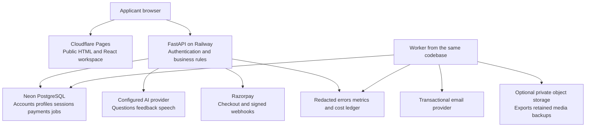

# Architecture hosting and migration plan

[Roadmap index](README.md)

## 1. Recommended architecture

Keep React and FastAPI. Move durable business data to managed PostgreSQL before the external pilot. Keep the API as a modular monolith: one codebase, clear domain modules, independently runnable API and worker processes when needed. PostgreSQL supports the relationships, transactions and auditability this product needs; no graph database is required for linked questions.

The frontend never receives database credentials, provider keys or payment secrets. The API owns entitlement, price and credit decisions. Public static content can remain available during an AI-provider outage. A failure in transcription should not prevent the user reading their saved transcript or using local recording practice.

## 2. Hosting comparison

Prices are public list prices checked on 8 October 2026, excluding taxes, currency conversion, promotions and overages. Planning ranges below are workload assumptions, not quotes. Recheck before purchase.

| Option | Fit and costs | Trade-off | Decision |
| --- | --- | --- | --- |
| Cloudflare Pages static frontend | Static requests are free/unlimited under the documented static-asset rules; functions are separately metered | Must implement current prerender/private/404 routing correctly | Recommended frontend; avoid adding Functions unless needed. [Pricing](https://developers.cloudflare.com/pages/functions/pricing/) |
| Railway API | Hobby $5 minimum including $5 usage; Pro $20 minimum including $20 usage | CPU/RAM/storage/egress can exceed the minimum; budgets can take workloads offline | Recommended container host; small pilot first, Pro budget for public paid launch. [Pricing](https://railway.com/pricing), [cost controls](https://docs.railway.com/pricing/cost-control) |
| Render API and PostgreSQL | Suitable managed service model; public pricing page did not expose a usable current compute table in this review | Obtain a current API+DB+backup quote before comparison; do not reuse old $7/$7 blog estimates | Strong alternative if consolidated operations/quote is better. [Pricing](https://render.com/pricing) |
| Vercel plus separate Python API | Good option if the public site later genuinely needs a Next.js workflow | Additional hosting product; Hobby is restricted to personal/non-commercial use | Do not make a revenue product depend on Hobby. [Plan rules](https://vercel.com/docs/plans/hobby) |
| Single VPS with app and PostgreSQL | Potentially lower invoice and full control | OS patching, DB recovery, capacity, TLS and on-call work become yours | Not the default for a solo founder seeking low ongoing workload; obtain quotes only if managed costs become material |
| AWS/GCP/Azure building blocks | Many capacity/security options | More configuration, billing surfaces and operating work | Revisit for a contractual/region/control need or demonstrated cost advantage, not as an initial badge of scalability |

Railway lists Singapore as an available deployment region. Prefer an API and database in the same geography and measure the actual network path; the same city across two vendors does not imply private networking. Verify Neon region availability in its live console/docs before provisioning. Do not promise Indian data residency with this stack. [Railway regions](https://docs.railway.com/deployments/regions)

## 3. Database choices

| Choice | Strength for this app | Cost/operational concern | Recommendation |
| --- | --- | --- | --- |
| Neon PostgreSQL | Preserves SQLAlchemy; managed restore, pooling and branching; separates DB from app host | Launch compute $0.106/CU-hour, storage $0.35/GB-month; restore history/snapshots cost extra. Current pricing says no monthly minimum | Preferred managed SQL option. 0.25 CU × 730h × $0.106 = $19.345 compute if always active, before other charges. [Pricing](https://neon.com/pricing) |
| Supabase PostgreSQL | Managed DB plus auth/storage ecosystem if those features are deliberately adopted | Pro starts $25/month with one default project included, daily backups retained seven days; extra projects/compute cost more. PITR is a separately priced add-on | Good alternative, particularly for a planned managed-auth/storage consolidation. Do not pay for a second auth system without a migration plan. [Pricing](https://supabase.com/pricing) |
| Railway PostgreSQL service | App/DB platform consolidation and private-network convenience | A deployed database service requires explicit ownership of backups, restore and upgrade behaviour; assess it against managed DB requirements | Accept only after the same restore/maintenance checks; do not equate “one click” with unattended database operations |
| Render managed PostgreSQL | App/DB consolidation alternative | Current size, recovery and region pricing must be obtained | Compare if choosing Render for the API |
| SQLite on a persistent disk | Excellent local/single-process simplicity | Container filesystem persistence, concurrent writes, multiple replicas and recovery need deliberate design | Keep for disposable/local tests; not the default paid deployment |
| Firebase/Firestore, MongoDB or Cloudflare D1 | Useful for different application patterns | Rewriting SQLAlchemy relationships and transaction logic creates migration risk without a demonstrated product benefit | Do not migrate this application to a new data model |

Neon free-tier restrictions and Supabase free-project inactivity pausing are reasons to pay a modest amount for relied-on applicant data. Use free projects for disposable development, not as the sole recovery plan. Neon spending notifications are alerts; set compute ceilings and app-level cost controls too. [Neon pricing](https://neon.com/pricing), [Supabase pausing](https://supabase.com/docs/guides/platform/free-project-pausing)

### Auth decision

**Default:** keep and harden the existing custom auth for the first controlled release. It already has password/Google login, refresh tokens and one-time-token flows. Introducing Supabase Auth or another service is possible, but changes token validation, identity mapping, account deletion and every authenticated API test.

Choose managed auth before launch if you are unwilling to maintain those responsibilities or a focused security review finds major gaps. In that case use one identity authority, map its stable subject to an internal user ID, preserve application ownership, and remove the old password/reset flow after migration. Do not operate two independent password stores indefinitely. Managed auth does not remove API ownership, CSRF, secure frontend or privacy obligations.

## 4. Concrete findings in this repository

| Finding | Evidence in source | Required action |
| --- | --- | --- |
| Auth emails point to localhost | `backend/services/auth_flows.py` builds verification/reset URLs using `http://localhost:3000` | Validated public frontend origin per environment; test both email link routes end to end |
| Schema mutation on startup | `backend/main.py` calls `create_all` and `run_schema_migrations` during import | Versioned release migration job; runtime role cannot change schema; API verifies schema compatibility |
| PostgreSQL evolution incomplete | `backend/services/migrations.py` returns after its PostgreSQL security helper; most additive schema logic is SQLite-specific | Alembic baseline plus explicit forward revisions; migration tests against PostgreSQL |
| Role assumptions in RLS helper | Existing policy grants based on `service_role` or a `postgres%` current-user name | Define intended runtime/owner roles and policies; do not carry a vendor-specific role assumption to Neon |
| Mutable catalogue file | `backend/services/program_catalog.py` writes `program_catalog_seed.json` | DB-backed draft/published catalogue; seed file becomes import-only; no container-disk admin edits |
| Process-local auth throttling | `backend/services/rate_limit.py` uses a memory dictionary/deques | Bounded shared limiter before replicas; expiry/cleanup; trusted-proxy IP handling; layer IP and account limits |
| Browser-readable auth tokens | `frontend/src/contexts/AuthContext.js` persists access/refresh tokens in localStorage | Prefer secure HttpOnly refresh cookie plus memory access token, with rotation/replay protection and CSRF/origin controls |
| AI call caps are not money caps | `services/interviews.py` uses durable count quotas; operation usage stores token metadata | Add amount reservations and reconciliation for text/audio/model prices; do not infer cost from call count |
| Reminder surface is preview/test | Reviewed reminder router has preview and send-test actions | Durable scheduling, opt-in delivery, deduplication and delivery/bounce handling before “automatic reminders” claims |
| Frontend container is development-only | `frontend/Dockerfile` uses Node 18 and `npm start` | Static production build on supported build runtime; lockfile-based install; do not expose the dev server |
| CRA build dependency | `frontend/package.json` uses react-scripts 5 | Migrate to a maintained build tool in a scoped change; preserve route rendering and tests. React has deprecated CRA. [React announcement](https://react.dev/blog/2025/02/14/sunsetting-create-react-app) |
| Notes/checklists include local-only data | `frontend/src/app/workspaceStorage.js` and current product docs | Explicit server-sync migration and conflicts, or accurate local-only labels until built |

This was a focused source review, not a credential, deployed-environment or full vulnerability audit. Dependency versions need a dedicated advisory/compatibility review before release. No original `.env`, private settings or production credentials were read.

## 5. Prelaunch migration sequence

### Step A: inventory and preserve

- Inventory all tables, indexes, foreign keys, unique constraints and browser-only state. Separate real founder data from synthetic test fixtures.
- Record current source revision and working-tree diff; commit a reviewed baseline when you choose to. Never reset the working tree to simplify migration.
- Write a data dictionary including timestamps, monetary units, consent versions and ownership. Money uses integer paise or Decimal; never binary float for billing.
- Create migration scripts against a disposable source copy. Do not run the existing reset/seed/pilot scripts against a valuable database: several are explicitly designed to reset local data.

### Step B: establish PostgreSQL schema

- Create independent staging and production databases/projects, using synthetic data in staging. A branch copied from production is not automatically safe test data.
- Create a migration owner and a restricted runtime role. The runtime gets necessary schema usage and table/sequence DML, not superuser/DDL.
- Keep DB credentials backend-only. Disable/exclude public data APIs for app tables if the chosen host provides them.
- Make an Alembic baseline from reviewed models, then a new revision for each change. Existing `create_all` does not evolve existing tables reliably.
- Choose an explicit RLS design. For the first API-only app, ownership enforcement can remain in the API with restricted backend access; do not call a broad service-role policy per-user isolation. If adopting transaction-scoped user RLS, cover auth/bootstrap/admin/background-job cases and connection-pool context reset before enabling it.
- Test runtime-role reads/writes and rejection of direct anonymous access. Test account A/B ownership under that actual role, not only a database owner.

### Step C: convert and verify

- Map booleans, dates/timezones, JSON text, enum-like strings and IDs explicitly. Preserve user IDs and child relationships if importing useful records.
- Load parent tables before children. Reset serial/identity sequences after importing explicit IDs.
- Compare row counts, primary-key sets, orphan checks, unique constraints and representative records. Counts alone do not validate field conversion.
- Test auth refresh/logout, résumé generation, concurrent interview answers, quota reservations and exports on PostgreSQL. SQLite success does not prove PostgreSQL concurrency behaviour.
- Run simultaneous duplicate operations and confirm a single durable result/credit effect. Exercise a provider timeout after it may have accepted work; reconcile ambiguous outcomes rather than retrying unboundedly.

### Step D: deploy and cut over

- Before the app is live, prefer a new clean production DB plus only deliberately retained founder records; do not import synthetic QA users.
- For a later migration with users, pause writes, snapshot source, import final delta, validate, switch API connection and smoke-test before reopening writes.
- Rollback before new writes can restore the old app/DB. After new writes, do not flip back to an old snapshot and lose them; reconcile/copy the delta or forward-fix. Record who makes that decision.
- Take and restore a backup into an isolated environment. Verify actual login-independent data queries, ownership and session history after restore.
- Remove runtime DDL, leave schema version checks, and retain an auditable migration log without credentials.

## 6. Setup checklist

| Resource | Setup | Completion evidence |
| --- | --- | --- |
| Domain/DNS | Owner account, MFA, recovery details, canonical hostname, staging subdomain | HTTPS plus correct redirects; renewal reminder owned by founder |
| Git/CI | Protected main branch, small reviewed changes, dependency scanning, synthetic fixtures | Build/unit/API tests pass in a clean environment; secret scan clean |
| Cloudflare Pages | Build frontend with postbuild renderer; correct app-shell/public-file/404 rules | Fetch public guide without JavaScript; private routes noindex; nonexistent route genuinely 404 |
| Railway | Backend container/start command, region, health/readiness checks, conservative resource limits | Deploy/restart without data loss; graceful shutdown and useful redacted logs |
| Neon | Region, pool endpoint, direct migration endpoint, restore window, compute ceiling | Connectivity/pooling load check; isolated restore drill |
| AI provider | Separate staging/prod project keys, model allowlist, application quotas/cost ledger | Key never in JS/logs; live eval and cap tests pass |
| Email | Dedicated sending subdomain, SPF/DKIM/DMARC, transactional templates and suppression list | Verify/reset links work in a real mailbox; bounces recorded |
| Payments | Account owner completes KYC; test/live separation; webhook signing and settlement mapping | Tests cover duplicate/out-of-order events, amount mismatch and refund |
| Observability | Error capture with scrubbing, uptime checks, application metrics, alert destination | A deliberate staging failure reaches the owner with no résumé/token body |
| Backups | Managed recovery plus independent encrypted logical export when practical | Successful restore and documented recovery timing |

Exact secret values belong in provider secret stores. Record variable names/purposes, owners and rotation dates in a runbook. Public frontend values may include API URL and site name; never put secrets in frontend build variables. Do not copy local configuration into deployment indiscriminately.

## 7. Data domains and future interfaces

Keep module boundaries for identity, catalogue, applications, preparation, interviews, billing, notifications and operations. A module owns its tables and service functions; it can share the same database and deployment.

| Domain | Proposed durable entities | Important invariant |
| --- | --- | --- |
| Applicant context | profile versions, facts, provenance, consent record | Session copies refer to a known profile version; edits do not silently rewrite old feedback |
| Programme | programme, intake, round, source, published revision | A deadline always belongs to the exact programme/intake/round |
| Applications | applications, milestones, notes, checklists | User-created values are distinguishable from verified catalogue facts |
| Interviews | sessions, turns, operations, plans, feedback revisions, evaluation metadata | One accepted answer/operation per idempotency key and expected version |
| Billing | orders, payments, payment events, credit grants/reservations/consumption/releases, refunds | No negative available balance or duplicate grant; every adjustment has a reason |
| Jobs | job/outbox, delivery attempt, dead-letter record | Retry-safe side effects and explicit ownership/lease |
| Growth | consented source attribution, canonical events, experiment assignment | No raw résumé/answer text or contact fields in analytics events |
| Support | ticket, severity, linked request ID, resolution | Staff access minimal and audited; applicant consent for content inspection |

A separate graph engine is unnecessary for 95 or a few thousand questions. Store edges in relational tables or versioned JSON; use PostgreSQL queries for retrieval. Introduce vector search only if a measured semantic-retrieval problem remains after topic/route/source filters. Do not upload all user histories to a vector service by default.

## 8. Scaling by bottleneck

| Trigger to measure | First action | Only later |
| --- | --- | --- |
| API memory high or parser pressure | Bound uploads, isolate parsing, profile memory, increase container modestly | Dedicated parser workers |
| AI waits exhaust request capacity | Explicit concurrency limit, persist operation state, async HTTP where suitable | Worker queue with polling/SSE and reconnect |
| DB connection pressure | Small explicit SQLAlchemy pool per process; pooler; reserve admin/migration connections | Increase DB size after query/index review |
| Repeated slow list views | Pagination, owner/time indexes, query timing and EXPLAIN | Read replicas/caches only when measured |
| Multiple API replicas | Shared rate limiting and job coordination first | Redis when database-backed controls become inefficient |
| Large audio/export storage | Private object storage, lifecycle expiry and signed access | CDN/private delivery strategy for actual media volume |
| Busy admission windows | Capacity test at 2× expected peak with provider stubs and small live canary | Autoscaling with upper bounds; no unbounded AI concurrency |

Capacity should be discussed in concurrent active interviews and requests/minute, not registered accounts. As an example, 20 simultaneously active users submitting every 90 seconds create about 13.3 answer calls/minute, before STT/TTS/feedback. This is a workload calculation, not proof that the starter instance/provider quota can serve it.

## 9. Frontend evolution and recovery

Migrate CRA to Vite as a separate task once deployment behaviour is covered by tests, or earlier if dependency review makes it necessary. Preserve the public renderer, generated paths, env-variable semantics, test framework and deep-link handling; a build-tool migration is not a redesign. React's deprecation announcement provides migration context. Public content can later move to Astro/another maintained static system if editorial volume justifies it; preserve canonicals and redirects. No full-stack Next.js rewrite is required to make the current public pages searchable.

For recovery, propose RPO ≤24 hours and RTO ≤4 hours for an invited pilot; tighten paid-data targets only after restore tests and provider capabilities support the promise. Payments/credits require reconciliation against the payment provider even after database recovery. Backup retention is not the same as an RPO guarantee. Publish realistic support hours and avoid a 99.99% marketing SLA your operating model cannot meet.
